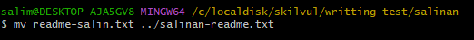

# Day 1 | Unix Command Line & Git

## **Pengertian Shell**

Shell merupakan program khusus yang digunakan untuk komunikasi langsung antara pengguna dengan sebuah sistem operasi.

## **Pengertian CLI**

Interface pada sebuah sistem operasi terbagi dua, yaitu **GUI (Graphical user interface)** dan juga **CLI (Command Line Interface)**.  
**Command Line Interface** merupakan sebuah mekanisme interaksi dengan komputer dengan mengetik perintah untuk menjalankan tugas tertentu.

## **Contoh CLI**

Beberapa contoh CLI adalah yang bisa kita gunakan :

- sh
- bash
- zsh
- cmd

## **Filesytem**

Sebuah filesystem memiliki tujuan untuk mengatur bagaimana sebuah data disimpan di dalam sebuah system.

## **Command pada Unix Command Line**

Berikut ini adalah beberapa command yang dapat digunakan untuk navigasi

- **pwd**  
  pwd merupakan sebuah perintah yang digunakan untuk melihat direktori kita berada sekarang

  ```
  pwd
  ```

- **ls**  
  ls merupakan sebuah perintah yang digunakan untuk melihat isi file yang ada pada sebuah direktori.

  ```
  ls
  ```

- **cd**  
  cd merupakan sebuah perintah yang digunakan untuk berpindah direktori, cara penggunaannya adalah.

  ```
  cd nama_direktori
  ```

Selain command untuk navigasi, ada juga command yang digunakan untuk memanipulasi file dan juga direktori

- **touch**  
  touch merupakan perintah yang digunakan untuk membuat file baru.

  ```
  touch nama_file
  ```

- mkdir  
  mkdir merupakan perintah yang digunakan untuk membuat sebuah direktori baru.

  ```
  mkdir nama_direktori
  ```

- head  
  head merupakan perintah yang digunakan untuk melihat beberapa line awal dari sebuah file text.

  ```
  head readme.txt
  ```

  

- tail  
  tail merupakan perintah yang digunakan untuk melihat beberapa line akhir dari sebuah file text.

  ```
  tail readme.txt
  ```

  

- cat  
  cat merupakan perintah yang digunakan untuk melihat isi semua file text.
  ```
  cat readme.txt
  ```
- cp  
  cp merupakan perintah yang digunakan untuk mengcopy file.

  ```
  cp readme.txt nama_direktori/nama_file_salinan
  ```

    
  pada kasus diatas merupakan cara mengcopy file readme.txt ke dalam direktori "salinan"

- mv  
  mv merupakan perintah yang digunakan untuk memindahkan file, selain itu perintah mv dapat digunakan untuk rename sebuah file

  ```
  mv readme-salin.txt nama_direktori/salinan-readme.txt
  ```

    
  kasus diatas merupakan cara memindahkan file readme-salin.txt | tanda ".." memilikir arti keluar satu langkah dari direktori saat ini.

- rm  
  rm merupakan perintah yang digunakan untuk menghapus file

  ```
  rm nama_file
  ```

  selain itu rm juga dapat digunakan untuk menghapus direktori

  - untuk mengapus direktori yang kosong

    ```
    rm -d nama_direktori
    ```

  - untuk mengapus direktori yang didalamnya terdapat file

    ```
    rm -r nama_direktori
    ```

## **Pengertian Git**

Git merupakan sebuah tool untuk programmer, tool ini sendiri digunakan sebagai Version Control System.  
Tugas dari Version Control System adalah untuk mencatat setiap perubahan pada file pada suatu project yang dikerjakan.

Git biasanya digunakan oleh programmer sebagai tempat penyimpanan file pemrograman mereka.

Dengan menggunakan git dan github, kita bisa bekerja dalam satu tim dengan tujuan berkolaborasi mengerjakan sebuah poject yang sama tanpa harus melakukan copy paste folder yang terupdate.

## **Perbedaan Git dengan Github**

- Git  
  Git merupakann software berbasis VCS (Version Control System) yang digunakan untuk mencatat setiap perubahan pada file
- Github  
  Github merupakan layanan cloud yang berguna untuk menyimpan dan mengelola suatu project.

## **Setup Awal Git**

Instal git pada laptop/pc kalian. Untuk mengecek apakah instalasi berhasil kalian dapat mengetikan command berikut pada git bash kalian

```
git --version
```

Hal yang harus diperhatikan saat pertama kali menggunakan git adalah melakukan setup username dan juga email github kita

```
git config --global user.name "username"
git config --global user.email email@gmail.com
```

Untuk mengecek apakah setup berhasil dapat menggunakan command

```
git config --list
```

## **Repository Git**

Repository merupakan direktori dari project yang kita buat. Setiap satu repository sama dengan satu project.

## **Membuat Repository Local**

untuk membuat repository pada direktori local, kalian dapat masuk ke dalam folder yang ingin di initialization dengan git. setelah itu masukan command berikut

```
git init
```

perintah ini digunakan satu kali saja untuk setiap pembuatan repository baru.

## **Membuat Repository pada Github**

Untuk membuat repo baru pada github kalian, yang pertamakali dilakukan adalah login ke akun github kalian masing-masing.  
Pada Resent Repository kalian akan melihat button new, klik untuk membuat repo baru.


Setelah klik button new maka akan muncul halaman baru. Ketikan nama repo yang diigninkan.


Setelah itu klik create repository.

## **Melakukan commit pada git**

Untuk melakukan commit kalian dapat melakukan beberapa langkah berikut.

Masuklah pada direktori project yang telah dipasangi git.  
Masukan command berikut ini untuk menambahka file didalam direktori menjadi status modified

```
git add .
```

Setelah kita menambahkan file menjadi status modified, selanjutnya adalah melakukan perintah commit untuk save perubahan pada version control

```
git commit -m "pesan commit bebas"
```

## **Mempublish pada github**

Setelah melakukan commit selanjutnya kita akan mempublish project kita pada github.  
Sebelum mempublish sebaiknya kalian ubah branch kalian dari master ke main dengan menggunakan perintah.

```
git branch -M main
```

Langkah selanjutnya adalah membuat remote yang digunakan untuk menghubungkan repo local kalian agar dapat terhubung pada repo pada github kalian.

```
git remote add origin https://github.com/salimsulaiman/Writting-Presentation.git
```

Dan untuk langkah terakhir adalah melakukan push

```
git push -u origi main
```

## **Melakukan clone ke direktori local**

Untuk melakan clonning kalian dapat mengikuti langkah berikut.  
Bukalah salah satu repository gihub yang ingin di clone. Pada bagian atas kalian akan melihat dropdown code, selanjutnya adalah copy link HTTPS tersebut.


Setelah mengcopy link tersebut, selanjutnya adalah masuk ke dalam direktori local kalian, klik kanan dan klik git bash here, selanjutnya masukan perintah berikut.

```
git clone https://github.com/salimsulaiman/Tshirt.git
```

Maka secara otomatis git akan melakukan clone dari github ke direktori local kalian.

# Day 2 | HTML

## **Peran HTML**

Apa itu HTML?, HTML merupakan singkatan dari Hypertext Markup Language. HTML ini digunakan untuk menampilkan konten pada browser kalian.  
HTML bukanlah sebuah bahasa pemrograman, dengan begitu artinya HTML tidak bisa dinamis mengolah data.

## Tools Pendukung dalam Menggunakan HTML

Sebagai programmer kita membutuhkan sekali yang namanya tools, tools ini digunakan untuk mempermudah dan menambah produktifitas kita sebagai programmer.  
Terdapat 2 tools utama untuk pendukung dalam pembuatan HTML

- Browser (Chrome, Edge, etc)
- Text Editor (VS Code, Subleme, Notepad++, etc)

## Membuat HTML sederhana

Pada umumnya HTML memiliki sebuah struktur seperti dibawah ini.

```html
<!DOCTYPE html>
<html lang="en">
  <head>
    <meta charset="UTF-8" />
    <meta http-equiv="X-UA-Compatible" content="IE=edge" />
    <meta name="viewport" content="width=device-width, initial-scale=1.0" />
    <title>Document</title>
  </head>
  <body>
    Hello, World!!
  </body>
</html>
```

## **Menjalankan HTML**

Terdapat beberapa cara untuk menjalankan file html

- Secara Manual  
  Untuk menjalankan file html secara manual kita dapat langsung double click pada file html yang telah kita buat, secara otomatis file html kita akan terbuka pada browser.
- Menggunakan live server pada vs code
  Yang pertama harus dilakukan adalah mendownload ekstensi live server pada vs code, setelah mendownload kalian hanya perlu klik kanan pada workspace file html kemudian klik Open with live server

  
**Note** : Keuntungan dari menggunakan live server ini adalah kita dapat real time mengubah file html tanpa harus melakukan refresh pada browser secara terus menerus.

## **HTML Element**

HTML Element memiliki opening tag dan juga clossing tag.  
Contoh opening tag : `<p>`  
Contoh closing tag : `</p>`

Tetapi ada juga element html yang memiliki single tag.  
Contoh : `<br>` , `<hr>`, `img`

## **Semantic HTML**

Semantic HTML artinya kita menggunakan element HTML yang sesuai dengan kebutuhan konten, contonya seperti article, header, footer, etc.

```html
<!DOCTYPE html>
<html lang="en">
  <head>
    <meta charset="UTF-8" />
    <meta http-equiv="X-UA-Compatible" content="IE=edge" />
    <meta name="viewport" content="width=device-width, initial-scale=1.0" />
    <title>Document</title>
  </head>
  <body>
    <header>
      <h1>Salim Blog</h1>
    </header>
    <nav>
      <li><a href="">Home</a></li>
      <li><a href="">About Us</a></li>
      <li><a href="">Contact Us</a></li>
    </nav>

    <article>
      <h3>This is my blog</h3>
      <p>
        Lorem ipsum dolor sit amet consectetur adipisicing elit. Neque, quas.
      </p>
    </article>
    <footer>&copy; Salim Sulaiman | 2022</footer>
  </body>
</html>
```

## **Melakukan deploy**

Deploy merupakan sebuah proses untuk menyebarkan aplikasi yang kita kerjakan agar bisa digunakan oleh orang lain.  
Untuk mendeploy HTML kita dapat menggunakan tools bernama Netlify.

- Register dan Login menggunakan email ataupun github.
- Masuk ke tab sites.
- drag & drop seluruh folder HTMl.

# Day 3 | CSS

## **Peran CSS**

CSS merupakan bahasa yang digunakan untuk mendesain sebuah halaman website.  
Dengan menggunakan CSS, kita dapat mengubah warna, mengubah font, mengatur tata letak, dll.

## **Struktur CSS**

```css
selector {
  property: value;
}
```

## **Cara menyisipkan CSS**

Terdapat 3 cara untuk menyisipkan CSS ke dalam HTML

- **Inline**  
  Cara menyisipkan CSS ini adalah dengan menggunakan attribut style di dalam HTML element.

```html
<!DOCTYPE html>
<html lang="en">
  <head>
    <meta charset="UTF-8" />
    <meta http-equiv="X-UA-Compatible" content="IE=edge" />
    <meta name="viewport" content="width=device-width, initial-scale=1.0" />
    <title>Document</title>
  </head>
  <body>
    <h1 style="color: #999">Hello World</h1>
  </body>
</html>
```

- **Internal**  
   Cara menyisipkan CSS ini adalah dengan menggunakan element `<style>` yang diletakan di dalam element `<head>`

  ```html
  <!DOCTYPE html>
  <html lang="en">
    <head>
      <meta charset="UTF-8" />
      <meta http-equiv="X-UA-Compatible" content="IE=edge" />
      <meta name="viewport" content="width=device-width, initial-scale=1.0" />
      <title>Document</title>
      <style>
        h1 {
          color: #999;
        }
      </style>
    </head>
    <body>
      <h1>Hello World</h1>
    </body>
  </html>
  ```

- **External**  
   Cara menyisipkan CSS ini adalah dengan cara membuat file CSS terpisah, lalu menyambungkannya dengan file html menggunakan element `<link>`. element tersebut diletakan di dalam element `<head>`

  Style.css

  ```css
  h1 {
    color: #999;
  }
  ```

  Index.html

  ```html
  <!DOCTYPE html>
  <html lang="en">
    <head>
      <meta charset="UTF-8" />
      <meta http-equiv="X-UA-Compatible" content="IE=edge" />
      <meta name="viewport" content="width=device-width, initial-scale=1.0" />
      <title>Document</title>
      <link rel="stylesheet" href="style.css" />
    </head>
    <body>
      <h1>Hello World</h1>
    </body>
  </html>
  ```

## **Sintaks dasar CSS**

CSS memiliki sebuah sintaks dasar, yaitu terdapat selector, property, dan juga value.  
 Sebagai contoh saat ingin merubah warna text kita dapat menggunakan sintaks berikut.

```css
h1 {
  color: #999;
}
```

h1 sebagai selector element mana yang ingin diatur dengan CSS.  
color sebagai property yang ingin diatur.  
#999 sebagai value.

## **Menerapkan Styling pada Sebuah Halaman HTML**

```html
<!DOCTYPE html>
<html lang="en">
  <head>
    <meta charset="UTF-8" />
    <meta http-equiv="X-UA-Compatible" content="IE=edge" />
    <meta name="viewport" content="width=device-width, initial-scale=1.0" />
    <title>Document</title>
    <style>
      body {
        padding: 50px 0;
      }
      * {
        font-family: "Poppins";
      }
      .text-center {
        text-align: center;
      }
      img {
        display: block;
        margin-left: auto;
        margin-right: auto;
      }
      h3 {
        color: #666;
      }
    </style>
  </head>
  <body>
    
    <h1 class="text-center">Salim Sulaiman</h1>
    <h3 class="text-center">Halo, perkenalkan nama saya Salim Sulaiman</h3>
    <h4 class="text-center">Saya dari Tegal</h4>

    <footer class="text-center">Copy &copy; Salim Sulaiman | 2022</footer>
  </body>
</html>
```

## **Display Flex**

Terdapat banyak cara untuk mengatur layout pada halaman html, salah satunya adalah FlexBox.  
Metode Flexbox menggunakan sebuah property display bernama Flex.

```css
.container {
  display: flex;
}
```

kita dapat menerapkan flexbox ini pada halaman html sehingga dapat mempermudah pengaturan tata letak konten di dalamnya.

```html
<!DOCTYPE html>
<html lang="en">
  <head>
    <meta charset="UTF-8" />
    <meta http-equiv="X-UA-Compatible" content="IE=edge" />
    <meta name="viewport" content="width=device-width, initial-scale=1.0" />
    <title>Document</title>
    <link rel="stylesheet" href="style.css" />
  </head>
  <body>
    <nav>
      <a href="">Salim Blog</a>
      <ul>
        <li><a href="">Home</a></li>
        <li><a href="">Blog</a></li>
        <li><a href="">About</a></li>
      </ul>
    </nav>

    <div class="container">
      <div class="home-text">
        <h1 class="text-center">Salim Sulaiman</h1>
        Programmer | Designer | Gamer
      </div>
      <div class="home-img">
        
      </div>
    </div>
  </body>
</html>
```

```css
* {
  font-family: "Poppins";
  margin: 0;
}
.text-center {
  text-align: center;
}
h3 {
  color: #666;
}
nav {
  position: relative;
  left: 0;
  display: flex;
  flex-direction: row;
  justify-content: space-between;
  padding: 10px 100px;
  background-color: #e94560;
}

ul {
  display: flex;
}

li {
  list-style: none;
  margin: 0 10px;
}
a {
  text-decoration: none;
  color: #fff;
}
.container {
  display: flex;
  padding: 100px 0;
  align-items: center;
  justify-content: center;
}
.home-text {
  margin: 0 100px;
}
.home-img {
  margin: 0 100px;
}
```
