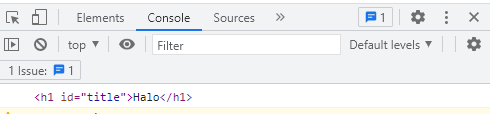
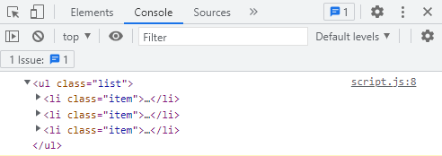
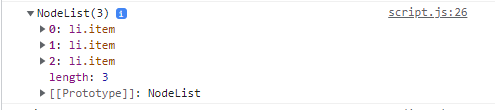

# Day 1 | Scope & Function

## **Scope**

Scope adalah konsep dalam flow data variabel. Untuk menentukan suatu variabel bisa diakses pada scope tertentu atau tidak.

### **Blocks**

Blocks adalah code yang berada didalam curly braces {}, conditional, function, dan looping menggunakan blocks.

### **Global Scope**

Global Scope berarti variabel yang kita buat dapat diakses dimanapun dalam satu file, untuk menjadi Global Scope, suatu variabel harus dideklarasikan diluar Blocks

```js
let nama = "Salim";

function greeting() {
  return nama; // output salim
}

console.log(nama); // output saim
```

### **Local Scope**

Local Scope berarti kita mendeklarasikan variabel di dalam blocks. Variabel tersebut hanya bisa diakses didalam blocks saja, tidak bisa diakses diluar blocks

```js
function greeting() {
  let nama = "Salim";
  return nama; // Salim
}

console.logA(greeting()); // output Salim
console.log(nama); // Uncaught ReferenceError: name is not defined because local scope
```

## **Function**

Function adalah sebuah blok kode dalam sebuah grup untuk menyelesaikan 1 task/1 fitur. Ketika kita membutuhkan fitur tersebut nantinya, kita bisa kembali menggunakannya.

### **Membuat Function**

```js
function greetWorld() {
  return "Hello World";
}
```

### **Memanggil Function**

Untuk memanggil function kalian dapat menggunakan cara berikut

```js
greetWorld(); // untuk memanggil function name
console.log(greetWorld()); // memanggil dan menampilkann function ke console
```

### **Parameter & Argument**

- **Parameter**

  Dengan parameter, function dapat menerima sebuah inputan data dan menggunakannya untuk melakukan task/tugas.  
  Untuk membuat function, kita harus mengetahui data-data yang dibutuhkan. Misal saat membuat function penambahan 2 buah nilai, data yang dibutuhkan adalah 2 nilai tersebut

  ```js
  function penambahan(nilai1, nilai2) {
    return nilai1 + nilai2;
  }
  ```

  nilai1, nilai2 merupakan parameter dari sebuah fungsi penambahan

- **Argument**

  Argument adalah nilai yang digunakan saat memanggil function.  
  Jumlah Argument harus sama dengan jumlah parameternya.

  ```js
  console.log(penambahan(2, 3)); // Output 5
  ```

  nilai 2 dan 3 pada code diatas disebut argument

- **Default Parameter**

  Default parameter digunakan untuk memberikan nilai awal/default pada parameter function.  
  Default paramater bisa digunakan jika kita ingin menjaga function agar tidak error saat dipanggil tanpa argument.

  ```js
  function greeting(name = "Salim") {
    return "Hello" + name;
  }

  console.log(greeting(Sulaiman)); // Output : Sulaiman
  console.log(greeting()); // Output : Salim
  ```

### **Funtion Helper**

Kita bisa menggunakan function yang sudah dibuat pada function lain

```js
function multiplyByNineFifths(number) {
  return number * (9 / 5);
}

function getFahrenheit(celcius) {
  return multiplyByNineFifths(celcius) + 32;
}

console.log(15); // Return 59
```

### **Arrow Funtion**

Arrow funtion merupakan cara penulisan function yang lebih mudah dan singkat, ini merupakan fitur terbaru yang ada pada ES6

```js
const greeting = () => {
  return "Hello World";
};

console.log(greeting()); //output Hello World
```

Cara penulisan parameter dengan arrow function

```js
const fullName = (firstName, lastName) => {
  return "Hello " + firstName + " " + lastName;
};

console.log(fullName(Salim, Sulaiman)); //output Salim Sulaiman
```

# Day 2 | Data Type Built in Prototype & Method

Javascript merupakan sebuah bahasa yang dinamis.

```js
let foo = 42;
foo = "bar";
foo = true;
```

## **Tipe Data**

Javascript memiliki beberapa tipe data.

- Primitive
  - Boolean
  - Null
  - Undefined
  - Number
  - Bright
  - String
  - Symbol
- Object

Kita juga dapat mengecek tipe data dari sebuah variabel, yaitu dengan menggunakan typeof

```js
let hewan = "kancil";
typeof hewan;
```

## **String**

Objek String ditandai dengan single quotes ataupun double quotes.
Kita juga dapat mengetahui panjang dari sebuah string yaitu dengan fitur lenght

```js
let greeting = "Hello";
console.log(greeting.length); // output 5
```

## **String Method**

- **toUpperCase**
  Mengubah string menjadi uppercase
  ```js
  let hewan = "kancil";
  console.log(hewan.toUpperCase()); // KANCIL
  ```
- **toLowerCase**
  Mengubah string menjadi lowercase
  ```js
  let hewan = "KANCIL";
  console.log(hewan.toLowerCase()); // kancil
  ```
- **charAt**
  Mengambil bagian String dengan menggunakan index
  ```js
  let hewan = "kancil";
  console.log(hewan.charAt(1)); // output a
  ```
- **includes**
  Digunakan untuk melakukan pencarian pada string
  ```js
  let hewan = "kancil";
  console.log(hewan.includes("n")); // output true
  ```
- **split**
  Membagi sebuah String, ketika dipisah akan menjadi data array
  ```js
  let kalimat = "Dengan menggunakan split(), kita dapat memisahkan string";
  console.log(kalimat.split(" "));
  ```

## **Number**

Number merupakan salah satu tipe data primitif

- **isNaN**
  Untuk mengecek apakah tipe data bukan merupakan number
  ```js
  isNaN("Hello"); //true
  isNaN(123); // false
  ```
- **toString**
  Mengubah sebuah tipe data dari number ke string
  ```js
  let angka = 20;
  console.log(angka.toString()); // '20'
  ```
- **toFixed**
  Menentukan jumlah angka di belakang koma
  ```js
  let dec = 3.1431221;
  console.log(dec.toFixed(2)); // '3.14'
  ```

## **Math**

Math merupakan built in object atau merupakan objek yang sudah disediakan oleh javascript

- Math.E //Bilangan Euler
- Math.LN2 //Log 2
- Math.LN10 //Log 10
- Math.LOG2E //Log E di basis 2
- Math.LOGE10 //Log E di basis 10
- Math.PI //pi
- Math.SQRT1_2 //Akar kuadrat dari 0.5
- Math.SQRT2 //Akar kuadrat dari 2

# Day 3 | DOM (Mengakses Halaman HTML)

## **Apa itu DOM?**

DOM (Document Object Model) merupakan programming interface pada Document Web. DOM digunakan untuk memanipulasi halaman HTML, membuat sebuah web menjadi dinamis.  
DOM bukan merupakan bagian dari javascript, melainkan merupakan sebuah web API untuk membangun sebuah website.  
DOM adalah jembatan agar bahasa pemrograman dapat berinteraksi dengan dokumen HTML, dengan DOM maka javascript dapat memanipulasi HTML.

## **Mengakses DOM**

index.html

```html
<!DOCTYPE html>
<html lang="en">
  <head>
    <meta charset="UTF-8" />
    <meta http-equiv="X-UA-Compatible" content="IE=edge" />
    <meta name="viewport" content="width=device-width, initial-scale=1.0" />
    <title>Document</title>
  </head>
  <body>
    <h1 id="title">Halo</h1>

    <ul class="list">
      <li class="item">satu</li>
      <li class="item">dua</li>
      <li class="item">tiga</li>
    </ul>
    <script src="script.js"></script>
  </body>
</html>
```

Terdapat berbagai cara untuk mengakses sebuah Element HTML.

- ### **getElementById**

  Cara pengaksesan ini adalah berdasarkan id pada sebuah element HTML. Contohnya saat ingin mengakses element h1 dengan id = "title".

  ```js
  let title = document.getElementById("title");
  console.log(title);
  ```

  

- ### **getElementsByClassName**

  Cara pengaksesan ini adalah dengan berdasarkan class pada sebuah element HTML. Contohnya saat ingin mengakses element li dengan class = "list".

  ```js
  let list = document.getElementsByClassName("list");
  console.log(list);
  ```

  Hasil yang didapatkan adalah berupa HTMLCollection, untuk mengaksesnya adalah dengan menggunakan index

  ```js
  let list = document.getElementsByClassName("list");
  console.log(list[0]);
  ```

  

- ### **getElemensByTagName**

  Cara pengaksesan ini adalah dengan berdasarkan tag name pada HTML. Contohnya saat ingin mengakses tag "li"

  ```js
  let itemByTag = document.getElementsByTagName("li");
  console.log(itemByTag[1]);
  ```

  Hasil yang didapatkan adalah berupa HTMLCollection, maka untuk mengaksesnya adalah dengan menggunakan index.

- ### **querySelector**

  Cara pengaksesan ini dapat berdasarkan id, class, maupun tag name.

  ```js
  let listQuery = document.querySelector(".list");
  console.log(listQuery);
  ```

  Contoh diatas adalah cara mengakses sebuah class dengan nama list.  
  **Note** :

  - untuk mengakses id menggunakan #
  - untuk mengakses class menggunakan . "titik"
  - untuk mengakses tag name dapat mengetikan langsung tag name yang ada

- ### **querySelectorAll**

  Cara pengaksesan ini dapat berdasarkan id, class, maupun tag name.

  ```js
  let itemQueryAll = document.querySelectorAll(".item");
  console.log(itemQueryAll);
  ```

  

  Yang dihasilkan berupa Node

- ### **parentElement**

  Untuk mengecek parent dari element yang diakses

  ```js
  let itemQuery = document.querySelector(".item");
  console.log(itemQuery.parentElement);
  ```

- ### **previousElementSibling**

  Untuk mengakses element sebelumnya

  ```js
  let itemQuery = document.querySelector(".item");
  console.log(itemQuery.previousElementSibling);
  ```

- ### **nextElementSibling**

  Untuk mengakses element setelahnya

  ```js
  let itemQuery = document.querySelector(".item");
  console.log(itemQuery.nextElementSibling);
  ```

# Day 4 | DOM (Memanipulasi Element HTML)

Dengan menggunakan DOM kita dapat memanipulasi element HTML

```html
<!DOCTYPE html>
<html lang="en">
  <head>
    <meta charset="UTF-8" />
    <meta http-equiv="X-UA-Compatible" content="IE=edge" />
    <meta name="viewport" content="width=device-width, initial-scale=1.0" />
    <title>Document</title>
    <style>
      #tess {
        background-color: brown;
        width: 100px;
        height: 50px;
      }
      p {
        background-color: antiquewhite;
      }
    </style>
  </head>
  <body>
    <div id="tess"></div>
    <div id="app"></div>

    <div id="end">
      <a href="www.google.com" class="link">Google</a>
    </div>
    <script src="script.js"></script>
  </body>
</html>
```

## **Menyisipkan Teks**

Untuk Menyisipkan/Menuiskan sebuah teks ke dalam element html menggunakan DOM adalah dengan **innerHTML**

```js
let app = document.getElementById("app");
console.log(app);

app.innerHTML = "<h1>Halo</h1>";
```

Dengan menggunakan innerHTML kita dapat menyisipkan Teks Halo pada element div dengan id app

## **Membuat element HTML**

Untuk membuat sebuah element HTML dengan menggunakan DOM kita dapat menggunakan createElement

```js
let p = document.createElement("p");
p.innerHTML = "ini adalah paragraf";

// memunculkan element
app.append(p);
```

Pada code diatas kita membuat sebuah element p, kemudian kita ingin menyisipkan sebuah teks ke tag p tersebut.  
append digunakan untuk memunculkan element html tersebut

## **Mengecek dan Mendapatkan attribut**

Dengan menggunakan DOM kita bisa mendapatkan attribut dari sebuah element. untuk mendapatkannya kita bisa menggunakan getAtrribute

```js
let link = document.getElementsByClassName("link")[0];
console.log(link.attributes);
console.log(link.getAttribute("href"));
```

## **Menambahkan Attribut**

DOM juga memiliki fungsi untuk menambahkan attribut pada element HTML. Untuk menambahkan attribut kita bisa menggunakan setAttribut

```js
let link = document.getElementsByClassName("link")[0];
link.setAttribute("id", "google");
```

## **Melakukan Styling**

DOM memiliki fungsi untuk melakukan styling pada element HTML.

```js
let link = document.getElementsByClassName("link")[0];
link.style.color = "black";
link.style.border = "1px solid black";
link.style.padding = "5px 20px";
link.style.backgroundColor = "aqua";
```

## **Mendapatkan/Mengecek Styling pada elemment HTML**

DOM juga dapat mengecek ataupun mengetehui styling apa saja yang ada pada sebuah element HTML

```js
let tess = document.getElementById("tess");
let tessStyle = getComputedStyle(tess);
console.log(tessStyle.height);
console.log(tessStyle.backgroundColor);
```

# Day 5 | DOM (Event)

## **Peran DOM Event**

User experience bersifat dua arah, selain menampilkan element HTML, website juga harus bisa menangkap interaksi user.  
Event sendiri merupakan kejadian/kegiatan/interaksi yang terjadi pada sebuah website.

Terdapat beberapa event pada DOM

- click
- submit
- focuss
- blur
- hover
- change
- scroll

## **Memberikan Event**

Terdapat 3 Cara dalam menggunakan Event

- ### **HTML Attribute**

  Contoh sederhana penggunaan Event menggunakan HTML Attribute

  ```html
  <!DOCTYPE html>
  <html lang="en">
    <head>
      <meta charset="UTF-8" />
      <meta http-equiv="X-UA-Compatible" content="IE=edge" />
      <meta name="viewport" content="width=device-width, initial-scale=1.0" />
      <title>Document</title>

      <script src="login.js" defer></script>
    </head>
    <body>
      <div class="container">
        <h1 onclick="alert('Selamat Datang')">Hallo</h1>
      </div>
    </body>
  </html>
  ```

- ### **Event Property**

  Cara penggunaannya adalah berdasarkan atrribute dari element HTML, seperti ID dan Class

  index.html

  ```html
  <!DOCTYPE html>
  <html lang="en">
    <head>
      <meta charset="UTF-8" />
      <meta http-equiv="X-UA-Compatible" content="IE=edge" />
      <meta name="viewport" content="width=device-width, initial-scale=1.0" />
      <title>Document</title>

      <script src="login.js" defer></script>
    </head>
    <body>
      <div class="container">
        <p id="paragraf">click me</p>
      </div>
    </body>
  </html>
  ```

  login.js

  ```js
  let paragraf = document.getElementById("paragraf");
  paragraf.onClick = function () {
    alert("ini adalah paragraf");
  };
  ```

- ### **addEventListener()**

  Kita dapat membuat event dengan menggunakan addEventListener().

  index.html

  ```html
  <!DOCTYPE html>
  <html lang="en">
    <head>
      <meta charset="UTF-8" />
      <meta http-equiv="X-UA-Compatible" content="IE=edge" />
      <meta name="viewport" content="width=device-width, initial-scale=1.0" />
      <title>Document</title>
    </head>
    <body>
      <button id="btn">Klik saya</button>
      <script src="script.js"></script>
    </body>
  </html>
  ```

  script.js

  ```js
  let button = document.getElementById("btn");
  button.addEventListener("click", function (event) {
    console.log(event.target);
    alert("ini dari button");
  });
  ```

## **Contoh penerapan DOM Event pada Form**

Buatlah sebuah file HTML dengan nama login.html

```html
<!DOCTYPE html>
<html lang="en">
  <head>
    <meta charset="UTF-8" />
    <meta http-equiv="X-UA-Compatible" content="IE=edge" />
    <meta name="viewport" content="width=device-width, initial-scale=1.0" />
    <title>Document</title>

    <script src="login.js" defer></script>
  </head>
  <body>
    <div class="container">
      <form id="sign-in">
        <h1>Sign In</h1>

        <div id="field">
          <label for="username">Username</label>
          <input type="text" id="username" name="username" />
        </div>

        <div id="field">
          <label for="password">Password</label>
          <input type="text" id="password" name="password" />
        </div>

        <button type="submit">login</button>
      </form>
    </div>
  </body>
</html>
```

Buatlah file javascript dengan nama login.js

```js
let loginForm = document.getElementById("sign-in");
let inputUsername = document.getElementById("username");
let inputPassword = document.getElementById("password");

let user = {
  username: "Salim",
  password: "admin",
};

loginForm.addEventListener("submit", (event) => {
  event.preventDefault();
  //   console.log(inputUsername.value);
  //   console.log(inputPassword.value);

  let userLogin = {
    username: inputUsername.value,
    password: inputPassword.value,
  };

  console.log(userLogin);

  if (
    userLogin.username == user.username &&
    userLogin.password == user.password
  ) {
    console.log("Selamat anda berhasil login");
  } else {
    console.log("Username dan Password anda salah");
  }

  loginForm.reset();
});
```

Video presentasi : [https://drive.google.com/file/d/1m3Gxie6EZz0qann33QnRSIaDCut7k15C/view?usp=sharing](https://drive.google.com/file/d/1m3Gxie6EZz0qann33QnRSIaDCut7k15C/view?usp=sharing)
