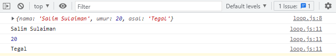

# Day 2 | Object

## **Pengertian Object**

**Object** merupakan sebuah tipe data pada variabel yang menyimpan properti dan fungsi.  
**Property** adalah data lengkap dari sebuah object.  
**Method** adalah action dari sebuah object

## **Membuat object**

Object memiliki sebuah key dan juga value.

```js
let namaObject = {
  key: value,
};
```

contoh untuk membuat object person

```js
let person = {
  nama: "Salim Sulaiman",
  umur: 20,
  gender: "Laki-laki",
};

console.log(person);
```

## **Mengakses Object**

Untuk mmengakses object kita bisa menggunakan 2 cara

**1. Dot Notation**

```js
let person = {
  nama: "Salim Sulaiman",
  umur: 20,
  gender: "Laki-laki",
};

console.log(person.nama); // output : Salim Sulaiman
```

**2. Bracket**

```js
let person = {
  nama: "Salim Sulaiman",
  umur: 20,
  gender: "Laki-laki",
};

console.log(person[umur]); // output : 20
```

## **Update data pada Object**

Kita dapat melakukan update pada variabel dengan tipe data object.  
Object dapat mengupdate value key yang sudah tersedia serta object dapat menambahkan key dan value baru

```js
let person = {
  nama: "Salim Sulaiman",
  umur: 20,
  gender: "Laki-laki",
};

// mengupdate value dari key yang sudah tersedia
person.umur = 21;

// menambah key dan value baru
person.address = "Tegal, Jawa Tengah";

console.log(person);
```

## **Menghapus Property Object**

Kita dapat menghapus property dari object menggunakna delete operator

```js
let person = {
  nama: "Salim Sulaiman",
  umur: 20,
  gender: "Laki-laki",
};

delete person.gender;

console.log(person);
```

## **Method pada Object**

Jika value yang kita masukan pada property berupa function, maka hal itu disebut method.

```js
const greeting = {
  welcome: function () {
    return "Halo selamat datang";
  },
  afterPay: function () {
    return "Terimakasih sudah membeli produk kami";
  },
};

console.log(greeting.afterPay()); // output : Terimakasih sudah membeli produk kami
```

## **Nested Object**

```js
let buku = {
  judul: "tips jago javascript",
  tahun: 2022,
  penulis: {
    penulis1: {
      nama: "Reyhan",
      umur: 28,
      kota: "Jakarta",
    },
    penulis2: {
      nama: "Aby",
      umur: 25,
      kota: "Bandung",
    },
  },
};

console.log(buku);
console.log(buku.penulis.penulis1.nama); // output Reyhan
```

## **Looping Object**

```js
// for in
let siswa = {
  nama: "Salim Sulaiman",
  umur: 20,
  asal: "Tegal",
};

console.log(siswa);

for (let key in siswa) {
  console.log(siswa[key]);
}
```

Output  
 

## **Array of Object**

Kita dapat menggunakan array of object untuk data yang lebih dari satu.

```js
let users = [
  {
    nama: "Reyhan",
    umur: 17,
    alamat: "Tegal",
  },
  {
    nama: "Wahyu",
    umur: 20,
    alamat: "Tegal",
  },
  {
    nama: "Aby",
    umur: 21,
    alamat: "Tegal",
  },
];

// menampilkan seluruh user
console.log(users);

// mengambil data dengan index 1
console.log(users[1]);

// melakukan looping
// parameter el dalam map berfungsi menggantikan nama dari object
let data = users.map((el) => {
  //   console.log(el.nama);
  // menambahkan property status disetiap object
  el.status = "aktif";
  return el;
});

console.log(data);
```
