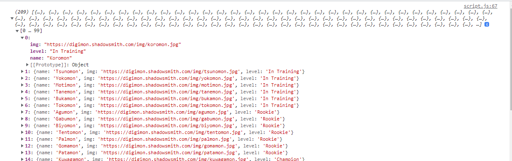

# Day 1 | Fetch & Async Await

## **Fetch**

Fetch memungkinkan javascript dapat berjalan di halamanan untuk membuat permintaan HTTP ke server dalam mengambil sepecific resource, dan ketika server menyediakan resource tersebut maka javascript dapat menggunakan data tersebut untuk ditampilkan pada halaman, untuk menampilkan ini biasannya menggunakan DOM. Data yang disediakan biasanya berupa json yang mana merupakan format terbaik untuk mentransfer sebuah data.

**Fetch** merupakan sebuah object promise yang telah disediakan oleh javascript.

## **Menangkap data dengan Async await**

Selain menggunakan then catch, kita dapat menangkap sebuah data menggunakan async await

```js
let nonton = (kondisi) => {
  return new Promise((resolve, reject) => {
    if (kondisi == "jalan") {
      resolve("Nonton Terpenuhi");
    } else {
      reject("Batal nonton");
    }
  });
};

async function asyncNonton() {
  try {
    let result = await nonton("jalan");
    console.log(result);
  } catch (error) {
    console.log(error);
  }
}

asyncNonton(); // output : nonton terpenuhi
```

## **API**

API atau Application Programming Interface dapat diartikan sebagai perantara antara sebuah website dengan server agar sebuah website atau aplikasi dapat saling bertukar data dengan mudah dan aman.

## **Menangkap data dari API**

terdapat 2 cara dalam menangkap data dari API, yaitu dengan menggunakan then catch dan juga async await.  
Sebagai contoh saat ingin mengambil data dari API https://digimon-api.vercel.app/api/digimon.

- Menggunakan then catch
  ```js
  fetch("https://digimon-api.vercel.app/api/digimon")
    .then((result) => {
      console.log(result);
      return result.json(); // unboxing
    })
    .then((result) => {
      console.log(result);
    })
    .catch((err) => {
      console.log(err);
    });
  ```
- Menggunakan async await

  ```js
  let getDataDigimon = async () => {
    try {
      let response = await fetch("https://digimon-api.vercel.app/api/digimon");
      let digimons = await response.json();
      console.log(digimons);
    } catch (error) {
      console.log(error);
    }
  };

  getDataDigimon();
  ```

Dari kedua cara diatas kita akan mendapatkan sebuah data json yang disediakan oleh server melalui API. dari data yang dihasilkan dapat berupa object ataupun array of object

