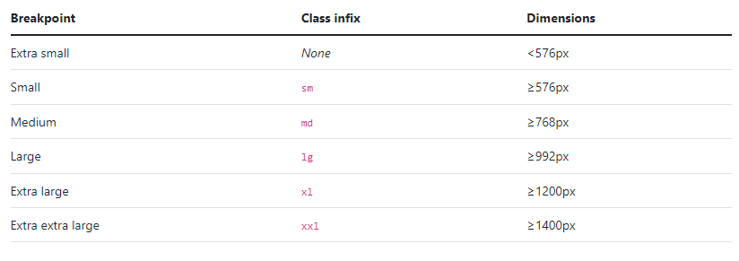
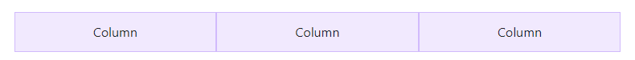

# Day 1 | Fetch & Async Await

## **Fetch**

Fetch memungkinkan javascript dapat berjalan di halamanan untuk membuat permintaan HTTP ke server dalam mengambil sepecific resource, dan ketika server menyediakan resource tersebut maka javascript dapat menggunakan data tersebut untuk ditampilkan pada halaman, untuk menampilkan ini biasannya menggunakan DOM. Data yang disediakan biasanya berupa json yang mana merupakan format terbaik untuk mentransfer sebuah data.

**Fetch** merupakan sebuah object promise yang telah disediakan oleh javascript.

## **Menangkap data dengan Async await**

Selain menggunakan then catch, kita dapat menangkap sebuah data menggunakan async await

```js
let nonton = (kondisi) => {
  return new Promise((resolve, reject) => {
    if (kondisi == "jalan") {
      resolve("Nonton Terpenuhi");
    } else {
      reject("Batal nonton");
    }
  });
};

async function asyncNonton() {
  try {
    let result = await nonton("jalan");
    console.log(result);
  } catch (error) {
    console.log(error);
  }
}

asyncNonton(); // output : nonton terpenuhi
```

## **API**

API atau Application Programming Interface dapat diartikan sebagai perantara antara sebuah website dengan server agar sebuah website atau aplikasi dapat saling bertukar data dengan mudah dan aman.

## **Menangkap data dari API**

terdapat 2 cara dalam menangkap data dari API, yaitu dengan menggunakan then catch dan juga async await.  
Sebagai contoh saat ingin mengambil data dari API https://digimon-api.vercel.app/api/digimon.

- Menggunakan then catch
  ```js
  fetch("https://digimon-api.vercel.app/api/digimon")
    .then((result) => {
      console.log(result);
      return result.json(); // unboxing
    })
    .then((result) => {
      console.log(result);
    })
    .catch((err) => {
      console.log(err);
    });
  ```
- Menggunakan async await

  ```js
  let getDataDigimon = async () => {
    try {
      let response = await fetch("https://digimon-api.vercel.app/api/digimon");
      let digimons = await response.json();
      console.log(digimons);
    } catch (error) {
      console.log(error);
    }
  };

  getDataDigimon();
  ```

Dari kedua cara diatas kita akan mendapatkan sebuah data json yang disediakan oleh server melalui API. dari data yang dihasilkan dapat berupa object ataupun array of object


# Day 3 | Responsive Web Design & Bootstrap

## **Responsive Web Design**

### **Pengertian RWD**

Responsive Web Design adalah bertujuan membuat design website kita dapat diakses dalam device manapun.

### **Chrome Dev Tools**

Chrome Dev Tools merupakan tools bawaan dari browser Chrome yang digunakan untuk memudahkan proses development website responsive
Untuk mengakses DevTools pada chrome dapat menggunakan shortcut `ctrl + shift + j`

### **Viewport**

Viewport merupakan area yang dilihat oleh pengguna kita pada balaman website.  
Untuk membuat website menjadi responsive kita perlu menambahkan meta viewport pada bagian head

```html
<meta name="viewport" content="width=device-width, initial-scale=1" />
```

### **max-width**

max width digunakan untuk menghindari terjadi overflow saat tampilan website diperkecil, cara menggunakannya adalah dengan menambahkan attribute max-width = 100% pada image

#### **Media Query**

media query merupakan salah satu cara membuat sebuah website menjadi responsive.  
umumnya terdapat 2 jenis media query, yaitu min-width dan max-width.

```css
@media screen and (min-width: 500px) {
  /* tag element and css */
}

@media screen and (max-width: 500px) {
  /* tag element and css */
}
```

### **Breakpoint**

Breakpoint merupakan perubahan yang terjadi pada tampilan saat berganti ukuran width.  
Terdapat 3 jenis breakpoint yaitu breakpoint untuk laptop, tablet, dan juga mobile.

### **Flex**

Terdapat banyak cara untuk mengatur membuat sebuah website responsive, salah satunya adalah FlexBox.  
Metode Flexbox menggunakan sebuah property display bernama Flex.

```css
.container {
  display: flex;
}
```

kita dapat menerapkan flexbox ini pada halaman html sehingga dapat mempermudah pengaturan tata letak konten di dalamnya.

```html
<!DOCTYPE html>
<html lang="en">
  <head>
    <meta charset="UTF-8" />
    <meta http-equiv="X-UA-Compatible" content="IE=edge" />
    <meta name="viewport" content="width=device-width, initial-scale=1.0" />
    <title>Document</title>
    <link rel="stylesheet" href="style.css" />
  </head>
  <body>
    <nav>
      <a href="">Salim Blog</a>
      <ul>
        <li><a href="">Home</a></li>
        <li><a href="">Blog</a></li>
        <li><a href="">About</a></li>
      </ul>
    </nav>

    <div class="container">
      <div class="home-text">
        <h1 class="text-center">Salim Sulaiman</h1>
        Programmer | Designer | Gamer
      </div>
      <div class="home-img">
        
      </div>
    </div>
  </body>
</html>
```

```css
* {
  font-family: "Poppins";
  margin: 0;
}
.text-center {
  text-align: center;
}
h3 {
  color: #666;
}
nav {
  position: relative;
  left: 0;
  display: flex;
  flex-direction: row;
  justify-content: space-between;
  padding: 10px 100px;
  background-color: #e94560;
}

ul {
  display: flex;
}

li {
  list-style: none;
  margin: 0 10px;
}
a {
  text-decoration: none;
  color: #fff;
}
.container {
  display: flex;
  padding: 100px 0;
  align-items: center;
  justify-content: center;
}
.home-text {
  margin: 0 100px;
}
.home-img {
  margin: 0 100px;
}
```

## **Bootstrap**

### **Pengertian**

Bootstrap merupakan framework opensource yang digunakan untuk membuat tampilan website menjadi responsive.

### **Menggunakan Bootstrap**

Untuk menggunakan bootstrap kita dapat memanggilnya dengan menggunakan CDN, terdapat 2 CDN yang harus ada di html kita.

```html
<!DOCTYPE html>
<html lang="en">
  <head>
    <meta charset="utf-8" />
    <meta name="viewport" content="width=device-width, initial-scale=1" />
    <title>Bootstrap demo</title>

    <!-- cdn untuk styling -->
    <link
      href="https://cdn.jsdelivr.net/npm/bootstrap@5.2.2/dist/css/bootstrap.min.css"
      rel="stylesheet"
      integrity="sha384-Zenh87qX5JnK2Jl0vWa8Ck2rdkQ2Bzep5IDxbcnCeuOxjzrPF/et3URy9Bv1WTRi"
      crossorigin="anonymous"
    />
  </head>
  <body>
    <h1>Hello, world!</h1>
    <!-- cdn untuk javascript -->
    <script
      src="https://cdn.jsdelivr.net/npm/bootstrap@5.2.2/dist/js/bootstrap.bundle.min.js"
      integrity="sha384-OERcA2EqjJCMA+/3y+gxIOqMEjwtxJY7qPCqsdltbNJuaOe923+mo//f6V8Qbsw3"
      crossorigin="anonymous"
    ></script>
  </body>
</html>
```

### **Layout**

- **breakpoints**  
  Breakpoints merupakan lebar yang dapat disesuaikan untuk menentukan ukuran responsive dari webiste atau ukura viewport pada browser
  Terdapat 6 breakpoints yang dimiliki bootstrap.  
  
- **container**  
  Kita dapat menggunakan class container untuk menampung isi konten dari website kita.

  ```html
  <div class="container">
    <!-- Content here -->
  </div>
  ```

- **grid**  
  Sistem grid pada bootstrap terdiri dari container, rows, dan juga columns. grid system milik bootstap menggunakan flexbox
  ```html
  <div class="container text-center">
    <div class="row">
      <div class="col">Column</div>
      <div class="col">Column</div>
      <div class="col">Column</div>
    </div>
  </div>
  ```
  

### **Content**

- **Images**  
  Untuk mengatur responsive sebuah image kita dapat menggunakan `class img-fluid`
  ```html
  
  ```

### **Component**

Terdapat banyak sekali component pada bootstrap

- **navbar**
  ```html
  <nav class="navbar navbar-expand-lg bg-light">
    <div class="container-fluid">
      <a class="navbar-brand" href="#">Navbar</a>
      <button
        class="navbar-toggler"
        type="button"
        data-bs-toggle="collapse"
        data-bs-target="#navbarNav"
        aria-controls="navbarNav"
        aria-expanded="false"
        aria-label="Toggle navigation"
      >
        <span class="navbar-toggler-icon"></span>
      </button>
      <div class="collapse navbar-collapse" id="navbarNav">
        <ul class="navbar-nav">
          <li class="nav-item">
            <a class="nav-link active" aria-current="page" href="#">Home</a>
          </li>
          <li class="nav-item">
            <a class="nav-link" href="#">Features</a>
          </li>
          <li class="nav-item">
            <a class="nav-link" href="#">Pricing</a>
          </li>
          <li class="nav-item">
            <a class="nav-link disabled">Disabled</a>
          </li>
        </ul>
      </div>
    </div>
  </nav>
  ```
- **cards**
  ```html
  <div class="card" style="width: 18rem;">
    
    <div class="card-body">
      <h5 class="card-title">Card title</h5>
      <p class="card-text">
        Some quick example text to build on the card title and make up the bulk
        of the card's content.
      </p>
      <a href="#" class="btn btn-primary">Go somewhere</a>
    </div>
  </div>
  ```
  Selain itu masih banyak sekali component boostrap yang tersedia. untuk lengkapnya ada pada dokumentasi bootstrap
